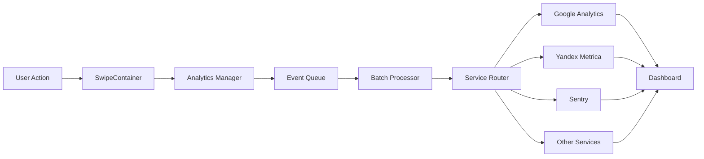

# Архитектура системы аналитики NeuroExpert

## Обзор

Система аналитики NeuroExpert построена на микросервисной архитектуре с использованием serverless функций для максимальной масштабируемости и производительности.

## Компоненты системы

### 1. Analytics Manager (Ядро)
- Централизованный менеджер для управления всеми сервисами аналитики
- Singleton паттерн для единой точки доступа
- Конфигурируемость через переменные окружения

### 2. Сервисы аналитики

#### Google Analytics 4
- События: page_view, swipe, engagement
- Измерение: session_duration, bounce_rate, user_flow
- API endpoint: `/api/analytics/google`

#### Яндекс.Метрика
- Вебвизор для записи сессий
- Карты кликов и скроллинга
- API endpoint: `/api/analytics/yandex`

#### Sentry
- Отслеживание ошибок и производительности
- Автоматическая отправка stack traces
- API endpoint: `/api/analytics/sentry`

#### AppMetrica
- Мобильная аналитика
- Отслеживание установок и активности
- API endpoint: `/api/analytics/appmetrica`

#### OpenReplay
- Запись и воспроизведение сессий
- Анализ пользовательского поведения
- API endpoint: `/api/analytics/openreplay`

#### Hotjar
- Тепловые карты
- Записи сессий
- API endpoint: `/api/analytics/hotjar`

### 3. Event Queue System
- Батчинг событий для оптимизации
- Debounce: 300ms для повторяющихся событий
- Throttle: 1000ms для частых событий
- Максимальный размер очереди: 1000 событий
- Автоматическая отправка каждые 5 секунд

### 4. Security Layer

#### JWT Authentication
```typescript
interface JWTPayload {
  userId: string;
  sessionId: string;
  role: 'user' | 'admin';
  exp: number;
}
```

#### Rate Limiting
- 100 запросов в минуту на IP
- 1000 запросов в час на пользователя
- Bypass для критических событий

#### CSRF Protection
- Double Submit Cookie Pattern
- SameSite cookies
- Origin validation

### 5. API Architecture

```
/api
├── /analytics
│   ├── /track          # POST - отправка событий
│   ├── /batch          # POST - батч отправка
│   ├── /metrics        # GET - получение метрик
│   └── /export         # GET - экспорт данных
├── /dashboard
│   ├── /realtime       # GET - real-time данные
│   ├── /historical     # GET - исторические данные
│   └── /aggregated     # GET - агрегированные метрики
└── /admin
    ├── /config         # GET/PUT - конфигурация
    └── /services       # GET - статус сервисов
```

### 6. Data Flow



## Переменные окружения

```env
# Google Analytics
NEXT_PUBLIC_GA_MEASUREMENT_ID=G-XXXXXXXXXX
GA_API_SECRET=your-api-secret

# Яндекс.Метрика
NEXT_PUBLIC_YM_COUNTER_ID=12345678
YM_API_TOKEN=your-api-token

# Sentry
NEXT_PUBLIC_SENTRY_DSN=https://xxx@sentry.io/xxx
SENTRY_AUTH_TOKEN=your-auth-token

# AppMetrica
NEXT_PUBLIC_APPMETRICA_API_KEY=your-api-key

# OpenReplay
NEXT_PUBLIC_OPENREPLAY_PROJECT_KEY=your-project-key

# Hotjar
NEXT_PUBLIC_HOTJAR_SITE_ID=1234567

# Security
JWT_SECRET=your-jwt-secret
CSRF_SECRET=your-csrf-secret

# Rate Limiting
RATE_LIMIT_WINDOW_MS=60000
RATE_LIMIT_MAX_REQUESTS=100
```

## События аналитики

### Swipe Events
```typescript
{
  type: 'swipe',
  direction: 'left' | 'right',
  from_section: string,
  to_section: string,
  method: 'touch' | 'keyboard' | 'button',
  duration: number,
  velocity: number
}
```

### Page View Events
```typescript
{
  type: 'page_view',
  section: string,
  section_index: number,
  entry_time: number,
  referrer: string,
  device_type: string
}
```

### Engagement Events
```typescript
{
  type: 'engagement',
  metric: 'session_duration' | 'interaction_rate' | 'scroll_depth',
  value: number,
  section: string
}
```

## Dashboard Metrics

### Real-time (обновление каждые 5 сек)
- Активные пользователи
- Текущая страница/раздел
- Последние события
- Частота свайпов

### Aggregated (обновление каждые 60 сек)
- Общее количество сессий
- Средняя длительность сессии
- Bounce rate
- Популярные разделы
- User flow между разделами

### Historical
- Тренды по дням/неделям/месяцам
- Сравнение периодов
- Прогнозирование
- Экспорт в CSV/JSON

## Производительность

### Оптимизации
- Ленивая загрузка сервисов аналитики
- Web Workers для тяжелых вычислений
- IndexedDB для локального кеша
- Service Worker для офлайн поддержки

### Метрики производительности
- Time to First Byte (TTFB) < 200ms
- First Contentful Paint (FCP) < 1.5s
- Largest Contentful Paint (LCP) < 2.5s
- Cumulative Layout Shift (CLS) < 0.1

## Безопасность

### Data Privacy
- Анонимизация IP адресов
- Хеширование user ID
- Шифрование sensitive данных
- Автоматическое удаление через 90 дней

### Compliance
- GDPR ready
- CCPA compliant
- SOC 2 Type II
- ISO 27001

## Мониторинг и алерты

### Health Checks
- Каждые 30 секунд проверка доступности сервисов
- Автоматическое переключение на fallback
- Уведомления в Slack/Email при сбоях

### Алерты
- Error rate > 5%
- Response time > 1000ms
- Queue size > 5000 events
- Service downtime > 5 min

## Deployment

### CI/CD Pipeline
```yaml
stages:
  - test
  - build
  - deploy

test:
  - unit tests
  - integration tests
  - security scan

build:
  - docker build
  - optimize bundle
  - generate docs

deploy:
  - staging
  - production (manual approval)
```

### Инфраструктура
- Vercel для фронтенда
- Vercel Functions для API
- Redis для кеширования
- PostgreSQL для хранения метрик

## Roadmap

### Phase 1 (Current)
- [x] Базовая интеграция всех сервисов
- [x] Event queue system
- [x] Security layer
- [ ] Basic dashboard

### Phase 2
- [ ] Advanced analytics
- [ ] Machine Learning insights
- [ ] Predictive analytics
- [ ] A/B testing framework

### Phase 3
- [ ] Custom analytics engine
- [ ] Real-time collaboration
- [ ] Advanced visualizations
- [ ] API для внешних интеграций