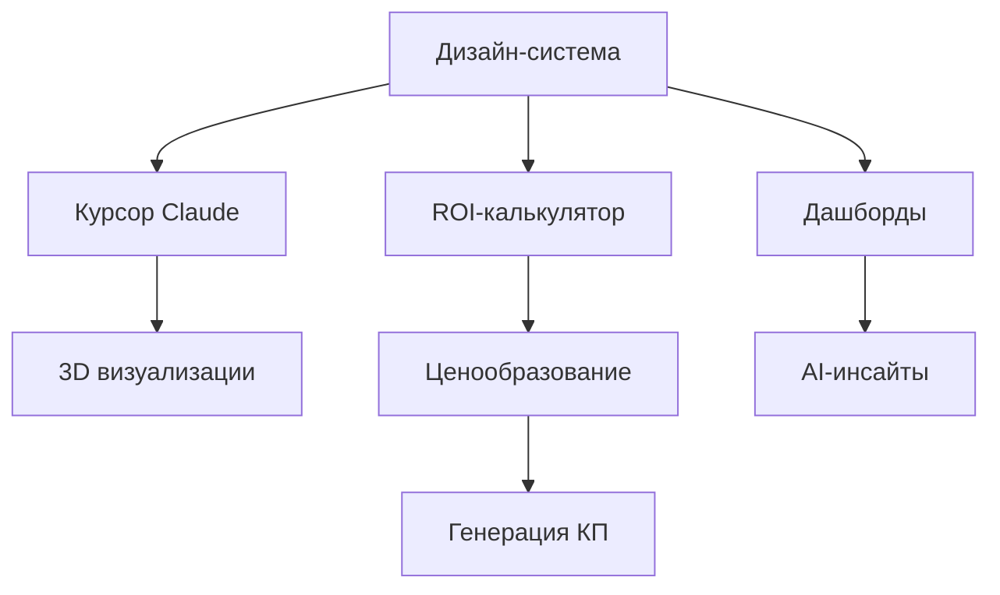

# 🚨 Анализ критического пути NeuroExpert

## 🎯 Приоритет 1: Критические задачи (блокирующие)

### 1. Обновление дизайн-системы (3-5 дней)
**Почему критично**: Все новые компоненты зависят от единого стиля
- [ ] Неоновые цвета и градиенты
- [ ] Футуристичные анимации
- [ ] UI Kit в Figma
- [ ] CSS переменные

### 2. Интеграция курсора Claude Opus 4 (5-7 дней)
**Почему критично**: Ключевая фича для AI-оркестрации
- [ ] Базовый визуальный курсор
- [ ] Контекстное меню
- [ ] AI анализ выделенного
- [ ] Сохранение аннотаций

### 3. Подключение аналитики для свайпа (2-3 дня)
**Почему критично**: Нужны метрики для оценки эффективности
- [ ] Google Analytics события
- [ ] Яндекс.Метрика
- [ ] Sentry для ошибок
- [ ] Базовый дашборд

## 🔥 Приоритет 2: Важные задачи (влияют на UX)

### 4. ROI-калькулятор v2.0 (7-10 дней)
- [ ] Monte Carlo симуляция
- [ ] Визуализация "взрыва потенциала"
- [ ] Интерактивные графики
- [ ] API для автоматизации

### 5. Автоматическое ценообразование (5-7 дней)
- [ ] Интеграция с HH.ru API
- [ ] Алгоритмы расчета
- [ ] Генерация КП в PDF
- [ ] Персонализация

### 6. Дашборды метрик (5-7 дней)
- [ ] Real-time визуализация
- [ ] Фильтры и экспорт
- [ ] AI-инсайты
- [ ] Мобильная версия

## 💎 Приоритет 3: Улучшения (nice to have)

### 7. 3D визуализации AI (10-14 дней)
- [ ] WebGL нейросети
- [ ] Анимированные потоки данных
- [ ] Интерактивность
- [ ] Performance оптимизация

### 8. Голосовой ассистент (7-10 дней)
- [ ] Web Speech API
- [ ] Команды управления
- [ ] Мультиязычность
- [ ] Обучение модели

### 9. Блокчейн интеграция (14-21 день)
- [ ] Smart contracts
- [ ] Web3 кошелек
- [ ] NFT сертификаты
- [ ] Децентрализованное хранение

## 📊 Диаграмма Ганта (упрощенная)

```
Неделя 1: [Дизайн-система][Аналитика]
Неделя 2: [Курсор Claude][ROI начало]
Неделя 3: [ROI продолжение][Ценообразование]
Неделя 4: [Дашборды][Тестирование]
Неделя 5: [3D визуализации начало]
Неделя 6: [3D продолжение][Голос начало]
Неделя 7: [Голос продолжение][Оптимизация]
Неделя 8: [Финальное тестирование][Деплой]
```

## 🔄 Зависимости между задачами



## ⚡ Quick Wins (можно сделать параллельно)

1. **Неоновые кнопки** (2 часа)
   - CSS анимации
   - Hover эффекты
   - Мгновенный "вау"

2. **Loading анимация AI** (4 часа)
   - Пульсирующий мозг
   - Нейронные связи
   - Брендированный loader

3. **Звуковые эффекты** (3 часа)
   - Клик кнопок
   - Свайп переходы
   - Успех/ошибка

4. **Градиентные заголовки** (2 часа)
   - CSS градиенты
   - Анимация переливов
   - Эффект глубины

## 🚧 Риски и блокеры

### Технические риски:
1. **Performance 3D визуализаций**
   - Митигация: Progressive enhancement
   - Fallback: 2D анимации

2. **Совместимость голосового API**
   - Митигация: Polyfills
   - Fallback: Текстовый ввод

3. **Скорость загрузки с анимациями**
   - Митигация: Lazy loading
   - Fallback: Reduced motion

### Организационные риски:
1. **Изменение требований**
   - Митигация: Agile sprints
   - Buffer: 20% времени

2. **Интеграция с legacy кодом**
   - Митигация: Адаптеры
   - Рефакторинг постепенный

## 📈 Метрики успеха по фазам

### Фаза 1 (Недели 1-2):
- ✅ Дизайн-система готова
- ✅ Базовый курсор работает
- ✅ Аналитика подключена

### Фаза 2 (Недели 3-4):
- ✅ ROI-калькулятор v2.0
- ✅ Автоматизация цен
- ✅ Дашборды запущены

### Фаза 3 (Недели 5-8):
- ✅ 3D визуализации
- ✅ Голосовой ввод
- ✅ Все тесты пройдены

## 🎯 Рекомендации

1. **Начать с дизайн-системы** - это разблокирует все остальное
2. **Курсор Claude делать параллельно** с дизайном
3. **ROI-калькулятор** можно начать после базового дизайна
4. **3D и голос** - только после core функционала
5. **Тестирование** - continuous, не откладывать

---

*Критический путь: Дизайн → Курсор → ROI → Дашборды → Деплой*
*Общее время: 8 недель при параллельной работе*